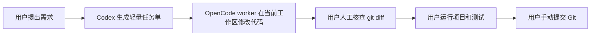

# Codex OpenCode Worker Workflow

一个本机个人级 Codex 技能，适用于所有 Git 项目：Codex 只生成轻量《AI 开发任务单》并调用 OpenCode，OpenCode worker 在当前 Git 工作区直接修改代码，用户负责人工核查、运行验证和最终 Git 决策。

默认模型 profile 是 DeepSeek V4 Pro，但 `codex-worker` 本身不绑定模型。后续切换其它 OpenCode 模型时，只改 `worker.config.json` 或脚本参数，不需要改 agent。

仓库地址：[ysj98/codex-opencode-deepseek-workflow](https://github.com/ysj98/codex-opencode-deepseek-workflow)

## 它解决什么问题

这个 workflow 的目标是减少 Codex token 消耗，把长上下文阅读和代码修改交给 OpenCode worker：

- **Codex**：生成短任务单，调用 OpenCode，报告 worker 结果和日志位置。
- **OpenCode worker 模型**：读取它需要的项目上下文，并在当前工作区按任务单修改代码。
- **用户**：查看 `git diff`，运行项目/测试，确认 UI 或业务效果，并决定是否 `git add/commit/push`。

它不会让 Codex 复核 diff、不会发起二次修复，也不会创建额外执行目录。

## 快速开始

### 1. 安装 skill

```powershell
git clone https://github.com/ysj98/codex-opencode-deepseek-workflow.git `
  "$HOME\.codex\skills\codex-opencode-deepseek-workflow"
```

### 2. 安装 OpenCode worker agent

```powershell
New-Item -ItemType Directory -Force "$HOME\.config\opencode\agents" | Out-Null

Copy-Item `
  "$HOME\.codex\skills\codex-opencode-deepseek-workflow\opencode\agents\codex-worker.md" `
  "$HOME\.config\opencode\agents\codex-worker.md" `
  -Force
```

`codex-worker` 只是一个可选 agent。只有脚本显式调用 `opencode run --agent codex-worker`，或你在 OpenCode 界面主动选择它时，它才会生效。

### 3. 确认 OpenCode 模型可用

默认 profile 使用 DeepSeek。请先在 OpenCode 中连接供应商：

```text
/connect
deepseek
```

然后确认模型 ID：

```powershell
opencode models deepseek --verbose
```

默认期望可用：

```text
deepseek/deepseek-v4-pro
```

## 使用方式

在任意 Git 项目中对 Codex 说：

```text
使用 $codex-opencode-deepseek-workflow，帮我实现这个需求：
...
```

或：

```text
用 OpenCode + DeepSeek V4 执行，Codex 只负责任务单和启动 worker。
...
```

Codex 会生成轻量《AI 开发任务单》，再调用 OpenCode worker 在当前工作区留下未提交修改。之后由你人工核查 `git diff`、运行项目和测试。

## 通用性原则

- 只要求目标目录是 Git 仓库。
- 不在业务仓库写入任务单、日志或执行摘要。
- 不预设语言、框架、测试命令或目录结构。
- 不要求工作区干净；如果已有未提交改动，worker 的修改会和现有 diff 混在一起。
- OpenCode worker 只在当前 Git 工作区内编辑文件。

## 模型配置

模型解析优先级：

1. `-Model`
2. `CODEX_OPENCODE_MODEL`
3. `-ModelProfile`
4. `CODEX_OPENCODE_MODEL_PROFILE`
5. `worker.config.json` 的 `defaultModelProfile`

默认配置：

```json
{
  "defaultModelProfile": "deepseek-v4-pro",
  "modelProfiles": {
    "deepseek-v4-pro": {
      "model": "deepseek/deepseek-v4-pro"
    }
  },
  "agent": "codex-worker",
  "runsRoot": ""
}
```

切换到其它模型时，新增 profile 并修改 `defaultModelProfile`：

```json
{
  "defaultModelProfile": "my-model",
  "modelProfiles": {
    "deepseek-v4-pro": {
      "model": "deepseek/deepseek-v4-pro"
    },
    "my-model": {
      "model": "provider/model-id"
    }
  }
}
```

也可以临时覆盖：

```powershell
powershell -NoProfile -ExecutionPolicy Bypass `
  -File "$HOME\.codex\skills\codex-opencode-deepseek-workflow\scripts\run-opencode-worker.ps1" `
  -RepoPath "D:\path\to\repo" `
  -TaskFile "C:\path\to\AI-DEV-TASK.md" `
  -Model "provider/model-id"
```

## 自动化工作流



Codex 不复核 diff、不运行验证命令，也不发起二次修复。这样能减少 Codex token 消耗，但也意味着人工核查是必需步骤。

## 任务单格式

《AI 开发任务单》固定包含：

- 任务目标
- 当前项目背景
- 必须遵守的项目规则
- 允许修改范围
- 禁止事项
- 实现要求
- 验收标准
- 建议验证命令
- 交付物要求

任务单应尽量短，只写目标、边界、禁止事项和已知验证方式。

## 安全边界

- 不自动 `git add`、`commit`、`push`。
- 不自动创建 PR。
- 不使用 OpenCode 自动权限批准或危险跳过权限模式。
- `codex-worker` 禁止 shell、子任务、外部目录、提交、推送和建 PR。
- 任务单、日志和执行摘要默认保存在用户级目录，不写入业务仓库。
- API Key 由 OpenCode 管理，本工具不读取、不保存、不打印。
- 当前工作区已有修改时不会阻断；用户需要自行区分旧 diff 和 worker 新 diff。

## 手动命令

生成任务单模板：

```powershell
powershell -NoProfile -ExecutionPolicy Bypass `
  -File "$HOME\.codex\skills\codex-opencode-deepseek-workflow\scripts\new-ai-task.ps1" `
  -RepoPath "D:\path\to\repo" `
  -Title "实现某个功能"
```

调用 worker：

```powershell
powershell -NoProfile -ExecutionPolicy Bypass `
  -File "$HOME\.codex\skills\codex-opencode-deepseek-workflow\scripts\run-opencode-worker.ps1" `
  -RepoPath "D:\path\to\repo" `
  -TaskFile "C:\path\to\AI-DEV-TASK.md" `
  -TaskSlug "feature-name"
```

## 文件结构

```text
codex-opencode-deepseek-workflow/
  SKILL.md
  README.md
  index.html
  worker.config.json
  agents/
    openai.yaml
  opencode/
    agents/
      codex-worker.md
  scripts/
    new-ai-task.ps1
    run-opencode-worker.ps1
```

## 常见问题

### `codex-worker` 会改变我的默认 OpenCode 行为吗？

不会。它只是一个可选 agent，不会修改你的供应商连接、API Key、默认模型或默认 agent。

### 为什么不再要求工作区干净？

这是为了减少流程和 token 消耗，让 OpenCode 直接在当前工作区执行。代价是已有修改和 worker 修改会出现在同一个 diff 中，需要用户人工核查。

### 为什么不自动验收？

最终运行效果和业务正确性必须由用户确认。这个轻量流程只负责生成任务单并启动 worker，不替用户判断代码是否可以提交。

## License

MIT
