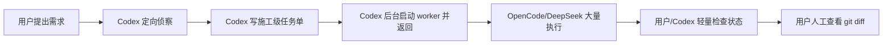

# Codex OpenCode Worker Workflow

一个本地个人级 Codex skill。它的目标是：尽可能减少 Codex 的 token/费用消耗，同时让 Codex 用自己的推理能力为 OpenCode/DeepSeek 写出高质量施工方案。实际读仓库、改代码、跑验证的高消耗工作交给 OpenCode worker。

默认运行方式是后台启动 worker：Codex 创建任务单并启动 OpenCode 后立刻返回 runDir、PID 和日志路径，不陪 DeepSeek 慢慢跑。

默认模型 profile 是 DeepSeek V4 Pro，但 `codex-worker` 本身不绑定模型。以后切换到其他 OpenCode 模型时，只改 `worker.config.json` 或脚本参数即可，不需要改 agent。

仓库地址：[ysj98/codex-opencode-deepseek-workflow](https://github.com/ysj98/codex-opencode-deepseek-workflow)

## 它解决什么问题

传统让 Codex 直接实现任务时，消耗通常集中在：

- 大范围读取项目上下文
- 设计实现细节
- 修改代码
- 等待测试和修复
- 复核最终 diff

这个 workflow 把分工改成：

- **Codex**：做定向侦察，理解需求，写施工级 `AI-DEV-TASK.md`，后台启动 worker，立刻报告日志。
- **OpenCode worker 模型**：大量读取、搜索、实现，并只运行聚焦且耗时可控的验证命令。
- **用户**：稍后检查 worker 状态，人工查看 `git diff`，确认效果，并决定是否 `git add/commit/push`。

这样 Codex 消耗保持可控，等待时间也短得多。

## 快速开始

### 1. 安装 skill

```powershell
git clone https://github.com/ysj98/codex-opencode-deepseek-workflow.git `
  "$HOME\.codex\skills\codex-opencode-deepseek-workflow"
```

### 2. 安装 OpenCode worker agent

```powershell
New-Item -ItemType Directory -Force "$HOME\.config\opencode\agents" | Out-Null

Copy-Item `
  "$HOME\.codex\skills\codex-opencode-deepseek-workflow\opencode\agents\codex-worker.md" `
  "$HOME\.config\opencode\agents\codex-worker.md" `
  -Force
```

`codex-worker` 只是一个可选 agent。只有脚本显式调用 `opencode run --agent codex-worker`，或你在 OpenCode 界面主动选择它时，它才会生效。

### 3. 确认 OpenCode 模型可用

先在 OpenCode 中连接供应商：

```text
/connect
deepseek
```

再确认模型 ID：

```powershell
opencode models deepseek --verbose
```

默认配置期望可用：

```text
deepseek/deepseek-v4-pro
```

## 使用方式

在任意 Git 项目中对 Codex 说：

```text
使用 $codex-opencode-deepseek-workflow，帮我实现这个需求：
...
```

或者：

```text
用 OpenCode + DeepSeek 执行。Codex 先做定向侦察并写详细任务单，后台启动 worker：
...
```

Codex 会读取少量关键文件，生成施工级 `AI-DEV-TASK.md`，再后台调用 OpenCode worker。你会立即拿到 runDir、PID、任务单和日志路径。

## 检查 worker 状态

后台 worker 运行时，Codex 不会主动轮询、等待、验证或总结。需要检查时，使用轻量检查脚本：

```powershell
powershell -NoProfile -ExecutionPolicy Bypass `
  -File "$HOME\.codex\skills\codex-opencode-deepseek-workflow\scripts\check-opencode-worker.ps1" `
  -RunDir "C:\Users\you\.codex\runs\codex-opencode-deepseek-workflow\your-run-dir"
```

默认只读取 `worker-summary.json`、完成状态和进程状态，不读取日志尾部。确实需要看日志时再加：

```powershell
-IncludeLogTail
```

## 工作流



## Codex 低消耗但高指导原则

- Codex 默认用 `guided` 侦察：读取指导文件、manifest/config 和最多 5 个相关文件。
- 小任务可用 `fast`：只读指导文件和 manifest/config。
- 风险任务可用 `deep-plan`：最多 12 个相关文件，但只在明确需要时使用。
- Codex 写出实现路线、入口线索、风险边界和验证建议。
- Codex 不直接改代码，不做全仓扫描，不等待 worker 完成，不主动检查进度，不复核最终 diff。
- OpenCode/DeepSeek 可以大量消耗 token 做仓库阅读、搜索和实现；验证命令应聚焦且有界。

## 模型配置

模型解析优先级：

1. `-Model`
2. `CODEX_OPENCODE_MODEL`
3. `-ModelProfile`
4. `CODEX_OPENCODE_MODEL_PROFILE`
5. `worker.config.json` 的 `defaultModelProfile`

默认配置：

```json
{
  "defaultModelProfile": "deepseek-v4-pro",
  "modelProfiles": {
    "deepseek-v4-pro": {
      "model": "deepseek/deepseek-v4-pro"
    }
  },
  "agent": "codex-worker",
  "runsRoot": ""
}
```

## 任务单格式

`AI-DEV-TASK.md` 固定包含：

- 任务目标
- Codex 定向侦察摘要
- 关键文件与入口线索
- 建议实现路线
- Worker 执行步骤
- 风险与边界
- 允许修改范围
- 禁止事项
- 验收标准
- 建议验证命令
- 交付物要求

任务单应该能指导 worker 施工：先看哪些文件、怎么定位调用链、建议怎么改、注意哪些兼容点、跑哪些验证。

## 安全边界

- 不自动 `git add`、`commit`、`push`。
- 不自动创建 PR。
- 不执行发布步骤。
- `codex-worker` 允许验证命令，但显式禁止 Git 提交/推送/重置、PR、发布、危险删除和 secret 读取类命令。
- 任务单、日志和执行摘要默认保存到用户级目录，不写入业务仓库。
- API key 由 OpenCode 管理；本工具不读取、不保存、不打印。

## 手动命令

生成任务单模板：

```powershell
powershell -NoProfile -ExecutionPolicy Bypass `
  -File "$HOME\.codex\skills\codex-opencode-deepseek-workflow\scripts\new-ai-task.ps1" `
  -RepoPath "D:\path\to\repo" `
  -Title "实现某个功能"
```

后台调用 worker：

```powershell
powershell -NoProfile -ExecutionPolicy Bypass `
  -File "$HOME\.codex\skills\codex-opencode-deepseek-workflow\scripts\run-opencode-worker.ps1" `
  -RepoPath "D:\path\to\repo" `
  -TaskFile "C:\path\to\AI-DEV-TASK.md" `
  -TaskSlug "feature-name" `
  -Background
```

同步调用 worker，仅在你明确想等待完成时使用：

```powershell
powershell -NoProfile -ExecutionPolicy Bypass `
  -File "$HOME\.codex\skills\codex-opencode-deepseek-workflow\scripts\run-opencode-worker.ps1" `
  -RepoPath "D:\path\to\repo" `
  -TaskFile "C:\path\to\AI-DEV-TASK.md" `
  -TaskSlug "feature-name"
```

## 文件结构

```text
codex-opencode-deepseek-workflow/
  SKILL.md
  README.md
  index.html
  worker.config.json
  agents/
    openai.yaml
  opencode/
    agents/
      codex-worker.md
  scripts/
    check-opencode-worker.ps1
    new-ai-task.ps1
    run-opencode-worker.ps1
```

## 常见问题

### 为什么后台运行更省 Codex？

同步等待时，Codex 会一直占着这一轮对话直到 worker 完成。后台运行后，Codex 只负责启动和报告路径，然后停止；DeepSeek/OpenCode 慢慢执行。只有你明确要求检查时，才用轻量脚本读取少量状态。

### 为什么允许 worker 运行验证命令？

因为这个 workflow 的目标是让 OpenCode/DeepSeek 承担主要 token 和执行成本。worker 可以跑测试、构建、类型检查等验证命令，但应选择与任务直接相关、耗时可控的命令。

### 为什么仍然不自动提交？

最终运行效果和业务正确性必须由用户确认。worker 可以验证，但 Git 决策仍由用户掌握。

## License

MIT
