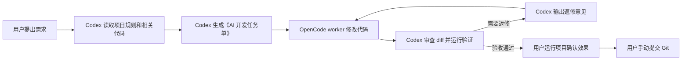

# Codex OpenCode Worker Workflow

一个本机个人级 Codex 技能，适用于所有 Git 项目：Codex 负责编排、任务单、diff 审查和验证验收；OpenCode 负责调用配置好的 worker 模型执行代码修改；用户保留运行确认和最终 Git 决策权。

默认模型 profile 是 DeepSeek V4 Pro，但 `codex-worker` 本身不绑定模型。后续切换其它 OpenCode 模型时，只改 `worker.config.json` 或脚本参数，不需要改 agent。

仓库地址：[ysj98/codex-opencode-deepseek-workflow](https://github.com/ysj98/codex-opencode-deepseek-workflow)

## 它解决什么问题

普通 AI 编码常把“理解需求、改代码、验收、提交”混在一起，容易出现越界修改、自己审自己、顺手提交等问题。

这个 workflow 把职责拆开：

- **Codex**：读项目规则，分析需求，生成《AI 开发任务单》，审查 `git diff`，运行验证命令，给出验收结论和返修意见。
- **OpenCode worker 模型**：只按任务单或返修意见修改代码，默认使用 DeepSeek V4 Pro profile。
- **用户**：运行项目，确认 UI/业务效果，决定是否 `git add/commit/push`。

## 快速开始

### 1. 安装 skill

```powershell
git clone https://github.com/ysj98/codex-opencode-deepseek-workflow.git `
  "$HOME\.codex\skills\codex-opencode-deepseek-workflow"
```

### 2. 安装 OpenCode worker agent

```powershell
New-Item -ItemType Directory -Force "$HOME\.config\opencode\agents" | Out-Null

Copy-Item `
  "$HOME\.codex\skills\codex-opencode-deepseek-workflow\opencode\agents\codex-worker.md" `
  "$HOME\.config\opencode\agents\codex-worker.md" `
  -Force
```

`codex-worker` 只是一个可选 agent。只有脚本显式调用 `opencode run --agent codex-worker`，或你在 OpenCode 界面主动选择它时，它才会生效。

### 3. 确认 OpenCode 模型可用

默认 profile 使用 DeepSeek。请先在 OpenCode 中连接供应商：

```text
/connect
deepseek
```

然后确认模型 ID：

```powershell
opencode models deepseek --verbose
```

默认期望可用：

```text
deepseek/deepseek-v4-pro
```

## 使用方式

在任意干净的 Git 项目中对 Codex 说：

```text
使用 $codex-opencode-deepseek-workflow，帮我实现这个需求：
...
```

或：

```text
用 OpenCode + DeepSeek V4 执行，Codex 负责任务单和 diff 审查。
...
```

Codex 会先读取项目规则和相关代码，生成《AI 开发任务单》，再调用 OpenCode worker 在外部 worktree 中留下未提交 diff。

## 通用性原则

- 只要求目标目录是 Git 仓库。
- 不在业务仓库写入任务单、日志或审查意见。
- 不预设语言、框架、测试命令或目录结构。
- 每次运行都从目标项目读取规则和验证方式。
- 源工作区不干净时停止，避免覆盖用户本地修改。

## 模型配置

模型解析优先级：

1. `-Model`
2. `CODEX_OPENCODE_MODEL`
3. `-ModelProfile`
4. `CODEX_OPENCODE_MODEL_PROFILE`
5. `worker.config.json` 的 `defaultModelProfile`

默认配置：

```json
{
  "defaultModelProfile": "deepseek-v4-pro",
  "modelProfiles": {
    "deepseek-v4-pro": {
      "model": "deepseek/deepseek-v4-pro"
    }
  },
  "agent": "codex-worker",
  "runsRoot": "",
  "worktreesRoot": ""
}
```

切换到其它模型时，新增 profile 并修改 `defaultModelProfile`：

```json
{
  "defaultModelProfile": "my-model",
  "modelProfiles": {
    "deepseek-v4-pro": {
      "model": "deepseek/deepseek-v4-pro"
    },
    "my-model": {
      "model": "provider/model-id"
    }
  }
}
```

也可以临时覆盖：

```powershell
powershell -NoProfile -ExecutionPolicy Bypass `
  -File "$HOME\.codex\skills\codex-opencode-deepseek-workflow\scripts\run-opencode-worker.ps1" `
  -RepoPath "D:\path\to\repo" `
  -TaskFile "C:\path\to\AI-DEV-TASK.md" `
  -Model "provider/model-id"
```

## 自动化工作流



自动返修最多 2 轮。仍未通过时，Codex 必须报告未解决问题，而不是声称完成。

## 任务单和审查格式

《AI 开发任务单》固定包含：

- 任务目标
- 当前项目背景
- 必须遵守的项目规则
- 允许修改范围
- 禁止事项
- 实现要求
- 验收标准
- 建议验证命令
- 交付物要求

Codex 审查和验收输出固定包含：

- diff 摘要
- 问题清单
- 必须返修项
- 建议优化项
- 验证结果
- 最终验收结论
- 是否允许进入人工运行确认

## 安全边界

- 不自动 `git add`、`commit`、`push`。
- 不自动创建 PR。
- 源工作区不干净时停止。
- OpenCode 只在外部 Git worktree 中改代码。
- 不使用 OpenCode 自动权限批准或危险跳过权限模式。
- `codex-worker` 禁止 shell、子任务、外部目录、提交、推送和建 PR。
- 任务单、日志、审查意见和执行摘要默认保存在用户级目录，不写入业务仓库。
- API Key 由 OpenCode 管理，本工具不读取、不保存、不打印。

## 手动命令

生成任务单模板：

```powershell
powershell -NoProfile -ExecutionPolicy Bypass `
  -File "$HOME\.codex\skills\codex-opencode-deepseek-workflow\scripts\new-ai-task.ps1" `
  -RepoPath "D:\path\to\repo" `
  -Title "实现某个功能"
```

调用 worker：

```powershell
powershell -NoProfile -ExecutionPolicy Bypass `
  -File "$HOME\.codex\skills\codex-opencode-deepseek-workflow\scripts\run-opencode-worker.ps1" `
  -RepoPath "D:\path\to\repo" `
  -TaskFile "C:\path\to\AI-DEV-TASK.md" `
  -TaskSlug "feature-name"
```

返修时复用生成的 worktree：

```powershell
powershell -NoProfile -ExecutionPolicy Bypass `
  -File "$HOME\.codex\skills\codex-opencode-deepseek-workflow\scripts\run-opencode-worker.ps1" `
  -RepoPath "D:\path\to\repo" `
  -ExistingWorktreePath "$HOME\.codex\worktrees\repo-task" `
  -TaskFile "C:\path\to\AI-DEV-TASK.md" `
  -FindingsFile "C:\path\to\CODEX-REVIEW-FINDINGS.md"
```

建议最多自动返修 2 轮。仍未通过时，停止并交给用户判断。

## 文件结构

```text
codex-opencode-deepseek-workflow/
  SKILL.md
  README.md
  index.html
  worker.config.json
  agents/
    openai.yaml
  opencode/
    agents/
      codex-worker.md
  scripts/
    new-ai-task.ps1
    run-opencode-worker.ps1
```

## 常见问题

### `codex-worker` 会改变我的默认 OpenCode 行为吗？

不会。它只是一个可选 agent，不会修改你的供应商连接、API Key、默认模型或默认 agent。

### 为什么要求源工作区干净？

为了避免 worker 模型叠加在用户未提交修改上继续改，导致 diff 难以审查和回滚。

### 为什么不自动提交？

最终运行效果和业务正确性必须由用户确认。工具只负责生成可审查、可返修的 diff。

## License

MIT
