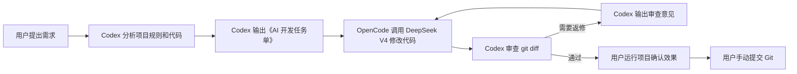

# Codex OpenCode DeepSeek Workflow

通用 AI 开发协作工具，用 **Codex CLI + OpenCode + DeepSeek V4** 组成一个清晰分工的开发流水线：

- **Codex 负责**：分析需求、制定计划、输出《AI 开发任务单》、审查 `git diff`、给出返修意见。
- **DeepSeek V4 负责**：通过 OpenCode 按任务单修改代码，并根据 Codex 审查意见返修。
- **你负责**：运行项目、确认实际效果、最终提交 Git。

仓库地址：[ysj98/codex-opencode-deepseek-workflow](https://github.com/ysj98/codex-opencode-deepseek-workflow)

## 为什么需要它

普通 AI 编码容易混在一起：一边理解需求，一边改代码，一边自我验收，最后还可能顺手提交。

这个工具把职责拆开：

1. Codex 先做架构控制和任务拆解。
2. DeepSeek V4 只做代码执行。
3. Codex 再做 diff 审查。
4. 用户保留最终运行确认和 Git 提交权。

这样更适合长期维护的项目，也更适合多仓库复用。

## 工作流



## 核心原则

- 不自动提交 Git。
- 不自动推送远端。
- 不自动创建 PR。
- 不覆盖用户未提交修改。
- 任务单、日志、审查意见默认保存在用户级目录，不写入业务仓库。
- DeepSeek V4 只在隔离 worktree 中改代码。

## 前置条件

- 已安装 Codex CLI。
- 已安装 OpenCode，并能执行 `opencode`。
- 已在 OpenCode 中连接 DeepSeek：

```text
/connect
deepseek
```

- OpenCode 可使用 DeepSeek V4 Pro 模型，例如：

```powershell
opencode models deepseek --verbose
```

应能看到：

```text
deepseek/deepseek-v4-pro
```

## 安装

将本仓库放入 Codex 用户技能目录：

```powershell
git clone https://github.com/ysj98/codex-opencode-deepseek-workflow.git `
  "$HOME\.codex\skills\codex-opencode-deepseek-workflow"
```

安装 OpenCode worker agent：

```powershell
New-Item -ItemType Directory -Force "$HOME\.config\opencode\agents" | Out-Null
Copy-Item `
  "$HOME\.codex\skills\codex-opencode-deepseek-workflow\opencode\agents\codex-worker.md" `
  "$HOME\.config\opencode\agents\codex-worker.md" `
  -Force
```

`codex-worker.md` 只是新增一个可选 agent，不会覆盖 OpenCode 默认 agent。只有显式执行 `opencode run --agent codex-worker ...`，或在 OpenCode 界面中手动选择 `codex-worker` 时，它才会生效。

确认技能配置：

```powershell
Get-Content "$HOME\.codex\skills\codex-opencode-deepseek-workflow\worker.config.json"
```

默认模型为：

```json
{
  "model": "deepseek/deepseek-v4-pro"
}
```

## 使用方式

在任意 Git 项目中对 Codex 说：

```text
使用 $codex-opencode-deepseek-workflow，帮我实现这个需求：
...
```

或：

```text
用 OpenCode + DeepSeek V4 执行，Codex 负责生成任务单和审查 diff。
...
```

Codex 会先读取项目规则和相关代码，然后输出《AI 开发任务单》。

## 手动生成任务单

```powershell
powershell -NoProfile -ExecutionPolicy Bypass `
  -File "$HOME\.codex\skills\codex-opencode-deepseek-workflow\scripts\new-ai-task.ps1" `
  -RepoPath "D:\path\to\your-repo" `
  -Title "实现某个功能"
```

脚本会输出任务单路径，任务单默认保存在：

```text
%USERPROFILE%\.codex\runs\codex-opencode-deepseek-workflow
```

## 调用 OpenCode Worker

```powershell
powershell -NoProfile -ExecutionPolicy Bypass `
  -File "$HOME\.codex\skills\codex-opencode-deepseek-workflow\scripts\run-opencode-worker.ps1" `
  -RepoPath "D:\path\to\your-repo" `
  -TaskFile "C:\path\to\AI-DEV-TASK.md" `
  -TaskSlug "feature-name"
```

脚本会：

- 检查目标目录是否为 Git 仓库。
- 检查源工作区是否干净。
- 创建外部 Git worktree。
- 调用 `opencode run`。
- 保存 OpenCode JSON 事件日志和执行摘要。
- 保留未提交 diff，供 Codex 审查。

## 返修流程

Codex 审查后会生成类似 `CODEX-REVIEW-FINDINGS.md` 的返修意见。

再次调用 worker：

```powershell
powershell -NoProfile -ExecutionPolicy Bypass `
  -File "$HOME\.codex\skills\codex-opencode-deepseek-workflow\scripts\run-opencode-worker.ps1" `
  -RepoPath "D:\path\to\your-repo" `
  -ExistingWorktreePath "C:\Users\you\.codex\worktrees\your-repo-task" `
  -TaskFile "C:\path\to\AI-DEV-TASK.md" `
  -FindingsFile "C:\path\to\CODEX-REVIEW-FINDINGS.md"
```

建议最多自动返修 2 轮。仍未通过时，应停止并交给用户判断。

## 文件结构

```text
codex-opencode-deepseek-workflow/
  SKILL.md
  README.md
  index.html
  worker.config.json
  agents/
    openai.yaml
  opencode/
    agents/
      codex-worker.md
  scripts/
    new-ai-task.ps1
    run-opencode-worker.ps1
```

## 《AI 开发任务单》字段

Codex 输出任务单时应包含：

- 任务目标
- 当前项目背景
- 必须遵守的项目规则
- 允许修改范围
- 禁止事项
- 实现要求
- 验收标准
- 建议验证命令
- 交付物要求

## Codex 审查输出字段

- diff 摘要
- 问题清单
- 必须返修项
- 建议优化项
- 是否允许进入人工运行确认

## 安全边界

`codex-worker` 的职责是限制 DeepSeek V4 的工作方式：

- 允许读取、搜索、编辑当前 worktree。
- 禁止 shell。
- 禁止子任务。
- 禁止访问外部目录。
- 禁止提交、推送、建 PR。

OpenCode 的 DeepSeek 连接和 API Key 由你手动维护。本工具不读取、不保存、不打印密钥。

如果你直接运行 `opencode`，并使用默认 agent 或其他 agent，`codex-worker.md` 不会改变你的日常 OpenCode 行为。

## 适配范围

只要求目标项目是 Git 仓库。具体语言和框架由 Codex 在任务前识别。

适合：

- Vue / React / Next.js 前端项目
- Node.js 工程
- Java / Spring 项目
- Python 项目
- 文档类仓库
- 多模块业务系统

## 常见问题

### `codex-worker.md` 是否必须？

不是连接 DeepSeek 的必需项。你仍然通过 OpenCode `/connect` 管理 DeepSeek。

但建议保留 `codex-worker.md`，因为它把 DeepSeek 的执行边界固化下来，避免每次都在 prompt 中重复约束。

### `codex-worker.md` 会影响我直接使用 OpenCode 吗？

不会。它只是在 OpenCode 的 agents 目录里增加一个名为 `codex-worker` 的可选执行角色，不会修改你的 DeepSeek 连接、API Key、默认模型或默认 agent。

它只在以下情况生效：

- 脚本调用 `opencode run --agent codex-worker ...`。
- 你在 OpenCode 界面中主动选择 `codex-worker`。

你平时直接运行 `opencode`，继续使用默认 agent、手动选择模型或手动输入需求时，不会被这个 workflow 接管。

### 为什么要求源工作区干净？

为了避免 DeepSeek 在用户未提交修改的基础上继续改，导致难以审查和回滚。

### 为什么不自动提交？

最终运行效果和业务正确性必须由用户确认。工具只负责生成可审查的 diff。

## License

MIT
